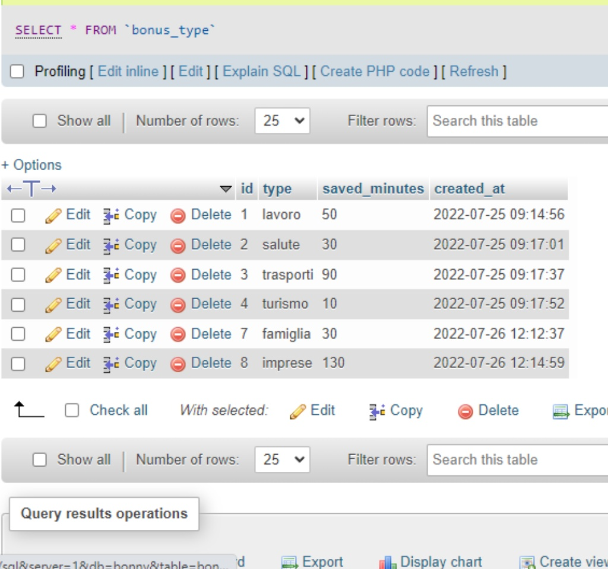
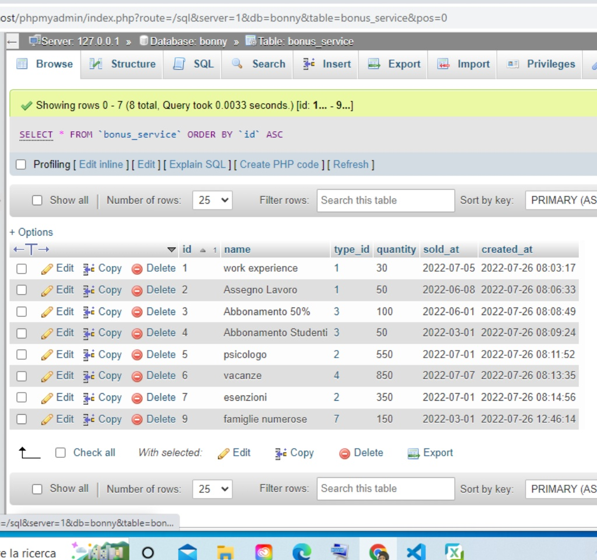
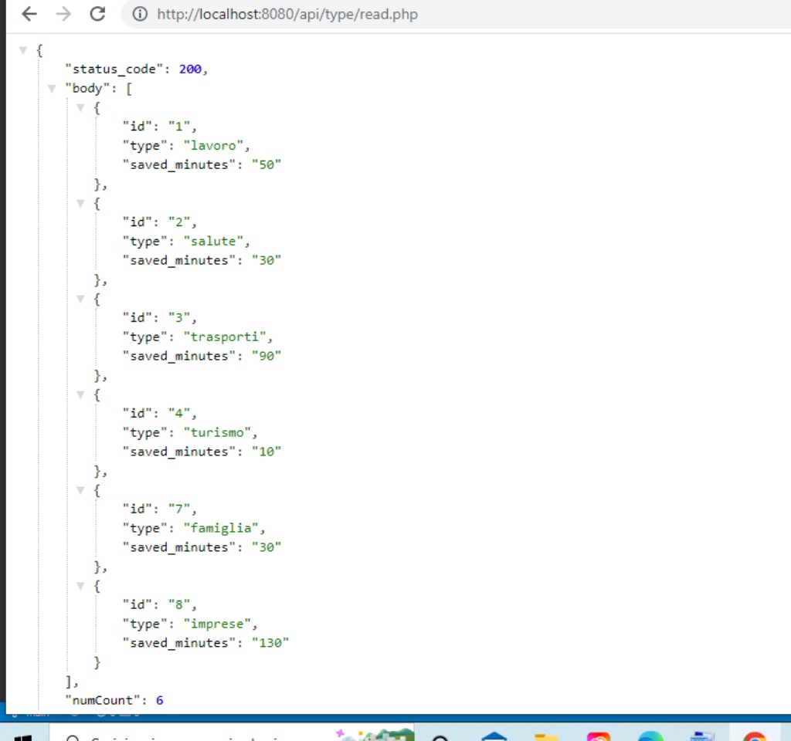
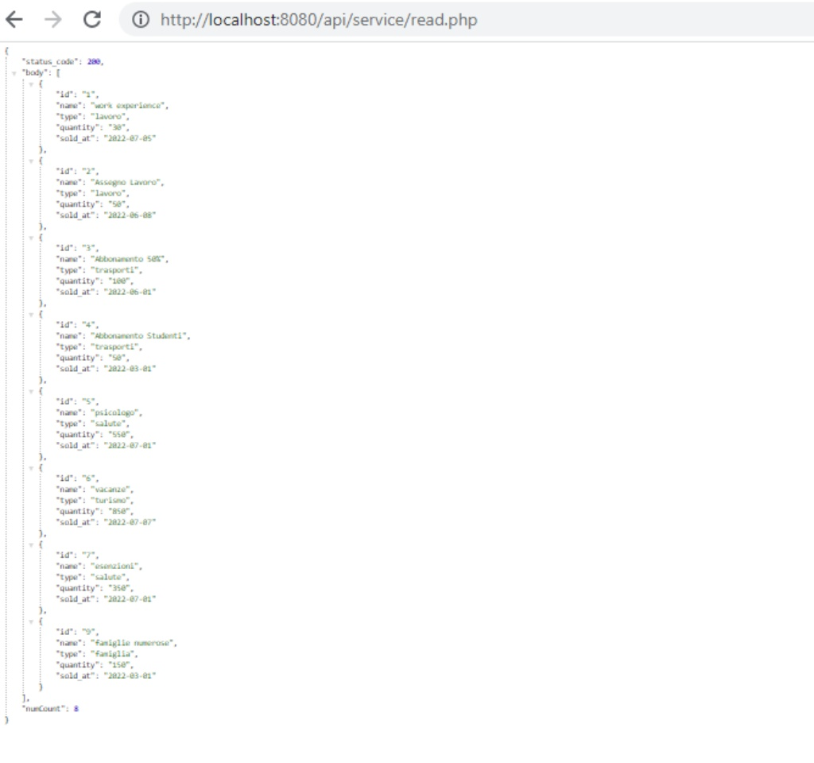

<p align="center">

  <h3 align="center">BONNY - State Bonus API</h3>

  <p align="center">
   This is a JSON RESTful API to implement the dashboard of a startup called Bonny created to simplify the life of Italian citizens by making the services and state bonuses of citizens more accessible and understandable.
  </p>

</p>

<details open="open">
  <summary><h2 style="display: inline-block">Table of Content</h2></summary>
  <ol>
    <li>
      <a href="#general-info">General Info</a>
      <ul>
        <li><a href="#built-with">Built With</a></li>
      </ul>
    </li>
    <li>
      <a href="#getting-started">Getting Started</a>
      <ul>
        <li><a href="#prerequisites">Prerequisites</a></li>
        <li><a href="#usage">Usage</a></li>
      </ul>
    </li>
    <li>
      <a href="#rest-api-endpoints">REST API Endpoints</a>
      <ul>
        <li><a href="#tests">Tests</a></li>
      </ul>
    </li>
    <li><a href="#license">License</a></li>
    <li><a href="#link">Link</a></li>
  </ol>
</details>

## General Info
This is a REST API developed with php and MySQL with which can be used to develop the dashboard of the Bonny startup.

### Built With

- [php](https://www.php.net/)
- [MySQL](https://www.mysql.com/)

## Getting Started

### Prerequisites

To run this api application a Web Server is required such as Apache. An integrated solution to run local web server can be used [XAMPP] and the likes.

### Usage

1. Clone the repository or download the zip file.  

2. Open the folder in your editor and create a config.php file raplacing the required data.

   ```sh
   return [

    "host" => "mysql:host=127.0.0.1",
    "db_name" => "database name",
    "username" => "root",
    "password" => "password",

    ];

   ```

3. To recreate the database follow the scheme you can find in the file <strong>db_migration.sql </strong>


## REST API Endpoints

- `GET /api/service/read.php` - Returns all data relating to state bonuses services and can be filtered using category-types and date-range.   
- `GET /api/type/read.php` - Returns all data relating to state bonuses types.
- `GET /api/type/saved_minutes.php` - Returns the total number of minutes saved for using the service.
- `POST /api/service/create.php` - Creates a new service of a bonus type.
- `POST /api/type/create.php` - Creates a new bonus type.
- `PUT /api/service/update.php` - Updates a service.
- `PUT /api/type/update.php` - Updates a bonus type.
- `DELETE /api/service/delete.php` - Deletes a service specifying the id.
- `DELETE /api/type/delete.php` - Deletes a bonus type specifying the id.

### Tests

- Postman can be used to test the REST API.

<p>Tables and Browser Views:</p>






## License

Distributed under the MIT License.

## Link

Project Repository: [Bonny-State-Bonus-api](https://github.com/oglili/Bonny-State-Bonus-api)
